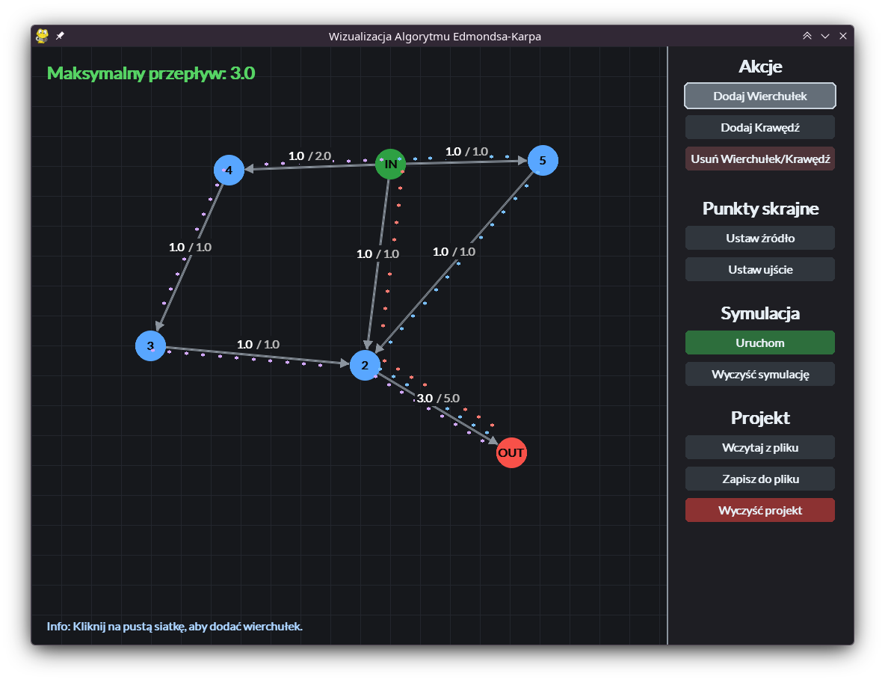

# Residual Flow Visualization

The program is used for designing, editing, and simulating pipeline networks to determine the maximum gas flow between two points: the source and the sink. The tool offers an interactive graphical user interface that allows users to dynamically build and modify the network topology, followed by visualizing the gas flow animation and reviewing the computed output.

## Authors

**Aleksander Grzegrzułka** 

**Adam Grzywacz** 

*Wydział Zastosowań Informatyki i Matematyki, Szkoła Główna Gospodarstwa Wiejskiego w Warszawie*
